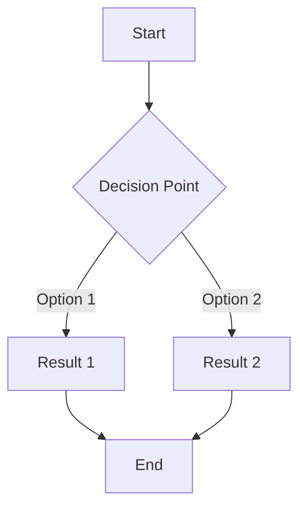

[](https://github.com/microsoft/ai-discovery-agent/actions/workflows/01-ci.yml)
[](https://github.com/microsoft/ai-discovery-agent/actions/workflows/02-ci-cd.yml)
[](https://github.com/microsoft/ai-discovery-agent/actions/workflows/03-checkov-security.yml)
[](https://github.com/microsoft/ai-discovery-agent/actions/workflows/10-release.yml)

# Welcome to Aida, the AI Discovery Agent and Workshop Facilitator

Aida is a set of AI agents designed to support the AI Discovery Workshop—a collaborative session that helps teams identify, define, and prioritize practical AI use cases for their business or organization. These agents assist both during workshop training and when facilitating real-world workshops by guiding discussions, managing tasks, and answering participant questions. The solution runs on [Chainlit](https://chainlit.io/).

## Prerequisites

- Python 3.12
- Azure OpenAI account with deployed models
- Git (for cloning the repository)

## Installation

1. **Fork the repository**:

   The `azd` deployment process requires write access to the repository to set up GitHub Actions for automated deployments. Please fork this repository to your own GitHub account.

2. **Clone the repository**:

   ```bash
   git clone https://github.com/youraccount/ai-discovery-agent.git
   cd ai-discovery-agent
   ```

3. **Install dependencies**:

   Install [uv](https://docs.astral.sh/uv/getting-started/installation/) for managing the virtual environment and dependencies:

   ```bash
   curl -LsSf https://astral.sh/uv/install.sh | sh
   ```

   ```bash
   cd src
   # Create a virtual environment and install requirements
   uv sync
   ```

4. **Configure authentication**:

   The application supports both password-based and OAuth authentication.

   > **⚠️ WARNING: The password authentication mechanism shown here is NOT SECURE and is ONLY for demonstration or workshop purposes.**
   > **Do NOT use this authentication setup in any production or public-facing environment, as it lacks essential security features and user management.**

   **Password Authentication (Optional)**:
   Rename the file [src/config/auth-config-example.yaml](src/config/auth-config-example.yaml) to `src/config/auth-config.yaml` and create users and passwords. This is a simple example, so we are not providing a secure authentication mechanism, nor a user maintenance interface. The authentication file is as simple as this:

   ```yaml
   credentials:
     usernames:
       attendee: # this is the username for login
         email: attendee@domain.com
         first_name: John
         last_name: Doe
         password: write_a_password # REPLACE this example password before deployment. Passwords will be hashed using PBKDF2-HMAC-SHA256 after first use and not stored in plain text.
         roles:
           - user # set user or admin
       facilitator:
         first_name: John
         last_name: Doe
         password: another_password
         roles:
           - admin
   ```

   **OAuth Authentication (Optional)**:
   OAuth authentication is optional and configured through environment variables. Users will see both password and OAuth login options when both are available.

   **OAuth Provider Configuration**:
   To set up OAuth providers, add the appropriate environment variables to your `.env` file (see [src/.example.env](src/.example.env)). OAuth will only be available if at least one provider is properly configured. For detailed information about configuring OAuth environment variables for different providers, see the [Chainlit OAuth documentation](https://docs.chainlit.io/authentication/oauth).

   Example OAuth configuration for GitHub:

   ```bash
   OAUTH_GITHUB_CLIENT_ID=your_github_client_id
   OAUTH_GITHUB_CLIENT_SECRET=your_github_client_secret
   ```

   Other supported OAuth providers include Google, Azure AD, GitLab, Auth0, Okta, Keycloak, Amazon Cognito, and Descope. Each provider requires specific environment variables as documented in the Chainlit OAuth guide.

   **Authentication Flow**:

   - If OAuth is enabled and configured, users will see both password and OAuth login options
   - If OAuth is disabled or not configured, only password authentication will be available
   - Users can switch between available authentication methods on the login page

5. [Optional] **Configure pages and agents**:
   If you want to create your own list of agents, rename the file [src/config/pages-example.yaml](src/config/pages-example.yaml) to `src/config/pages.yaml` to use the example configuration, and customize it to your needs.

6. **Create the needed resources**:
   See next section for deploying the website. The command `azd provision` will create all the resources you need on Azure using the [`infra`](infra) folder, and will also generate the .env file with the needed values for running the solution locally. The infrastructure is secure by default, using private endpoints for Azure OpenAI and Storage. During development, the AZD command automatically enables public network access for easier local development. You need to be logged in with the az and azd commands:

   ```bash
   az login
   azd auth login
   azd provision
   ```

7. **Run the application**:
   ```bash
   uv run -m chainlit run -dhw chainlit_app.py
   ```

### (Optional) Local Azure Storage with Azurite

For local development you can avoid provisioning a real Azure Storage Account by using the Azurite emulator. The deployment script creates secure infrastructure with private endpoints by default, but automatically enables public network access during development for easier local development access.

This project will automatically use Azurite if you supply a development storage connection string via `AZURE_STORAGE_CONNECTION_STRING` (the persistence layer in `src/persistence/azure_storage.py` first checks for a connection string).

Quick start options:

1. Docker (recommended):

```bash
docker run --rm -p 10000:10000 -p 10001:10001 -p 10002:10002 mcr.microsoft.com/azure-storage/azurite
```

2. VS Code Extension: Install the "Azurite" extension and press "Start".
3. NPM (if you already have Node): `npm install -g azurite` then `azurite`.

Then set the environment variable in your local `.env` (or export it in your shell) before starting the app:

> **⚠️ WARNING:**
> The below connection string is **for local development only** and contains the default Azurite/Storage Emulator account key, which is **publicly known and should _never_ be used in production environments**.
> Always use a secure, provisioned Azure Storage account (with a unique key or Managed Identity) for production and CI/CD deployments.

```bash
AZURE_STORAGE_CONNECTION_STRING= "DefaultEndpointsProtocol=http;AccountName=devstoreaccount1;AccountKey=Eby8vdM02xNOcqFlqUwJPLlmEtlCDXJ1OUzFT50uSRZ6IFsuFq2UVErCz4I6tq/K1SZFPTOtr/KBHBeksoGMGw==;BlobEndpoint=http://127.0.0.1:10000/devstoreaccount1;"
```

The default Azurite blob endpoint will be `http://127.0.0.1:10000/devstoreaccount1`.

Notes:

- The files `__azurite_db_blob__.json` and `__azurite_db_blob_extent__.json` in the repo root are Azurite local state; you can delete them safely if you want a clean slate—Azurite recreates them.
- Do NOT use Azurite for production. In CI/CD or real deployments rely on the provisioned Azure Storage resource and either a fully formed connection string or Managed Identity (see deployment section).

## Deployment

In the [infra](./infra) folder, you can find the bicep template to deploy the application to Azure. It includes:

- An Azure App Service to host the Chainlit application
- An Azure App Service staging slot for safe deployments
- An Azure OpenAI resource for AI model access with private endpoint security
- An Azure Storage Account with private endpoint security
- Virtual Network (VNet) infrastructure for secure connectivity

The infrastructure is **secure by default**, using private endpoints for both Azure OpenAI and Storage Account to ensure network isolation. During development, public network access is automatically enabled to facilitate local development and testing.

### Local Development Deployment

This has been developed with the Azure Developer CLI, which simplifies the deployment process. For local development and testing, you can deploy it using the following command from the root of the repository:

```bash
azd up
```

### Production Deployment with Staging Slots

**Automated GitHub Actions Deployment**: When code is merged to the `main` branch, the GitHub Actions workflow automatically:

1. **Provisions Infrastructure**: Uses `azd provision` to create or update Azure resources including the App Service with both production and staging slots
2. **Deploys to Staging Slot**: Uses the Azure Web App Deploy action to deploy the application to the `staging` slot instead of directly to production

This approach provides a safer deployment process where:

- The staging slot receives the latest code changes
- You can test the application in the staging environment before promoting to production
- Manual slot swapping can be performed through the Azure Portal when ready for production

**Manual Slot Management**: After the automated deployment to staging, you can:

- Test the application at `https://your-app-name-staging.azurewebsites.net`
- Swap slots through the Azure Portal to promote staging to production
- Configure auto-swap if desired (not included in the current template)

**Why Staging Slots?**: The Azure Developer CLI (`azd`) currently does not support deployment to specific App Service slots ([Azure/azure-dev#2373](https://github.com/Azure/azure-dev/issues/2373)). The GitHub Actions workflow works around this limitation by using the Azure Web App Deploy action directly for slot-specific deployments while still using `azd` for infrastructure provisioning.

## Architecture & Infrastructure

For the full, in-depth architecture, security guardrails, deployment workflow, networking model, and extensibility guidelines, see **[ARCHITECTURE.md](ARCHITECTURE.md)**.

This README intentionally stays concise—`ARCHITECTURE.md` covers:

- Module structure (VNet, storage, private endpoints, OpenAI)
- Security & networking (private endpoints, IP allow list, identity)
- Model deployment strategy
- Environment & provisioning flow (`azd`, mapping scripts)
- Verification & troubleshooting checklists
- Extensibility patterns for adding new Azure services

## Responsible AI

This project is committed to responsible AI development and deployment. We follow [Microsoft's Responsible AI Principles](https://www.microsoft.com/ai/responsible-ai) across six key dimensions:

- **Fairness:** No discrimination; inclusive design; regular fairness audits
- **Reliability & Safety:** Content safety filters; prompt injection protection; abuse monitoring
- **Privacy & Security:** Data encryption; minimal data collection; 90-day auto-deletion
- **Inclusiveness:** Accessible design; support for diverse users and industries
- **Transparency:** Clear AI disclosure; documented limitations; user-facing transparency guide
- **Accountability:** RAI governance process; human oversight; comprehensive monitoring

### RAI Documentation

📋 **[RAI Review](docs/RAI_REVIEW.md)** - Comprehensive responsible AI assessment including:
- Risk summary and mitigation strategies
- Detailed findings across all RAI dimensions
- Implementation recommendations with code examples
- Evaluation plans and monitoring strategies

📊 **[Model Card](docs/MODEL_CARD.md)** - Technical documentation of AI models:
- Model architecture and components
- Intended uses and limitations
- Performance metrics and known failure modes
- Ethical considerations

🎯 **[RAI Principles](docs/RESPONSIBLE_AI_PRINCIPLES.md)** - Governance framework:
- Core principles and commitments
- Roles and responsibilities
- Change control process
- Incident response procedures

🤝 **[AI Transparency Guide](docs/AI_TRANSPARENCY_GUIDE.md)** - User-facing documentation:
- What the AI can and cannot do
- Privacy protections explained
- When to seek human help
- Tips for best results

### Quick Start: RAI Best Practices

**For Users:**
- ✅ Verify AI suggestions with human experts
- ✅ Don't share sensitive or confidential information
- ✅ Provide feedback using thumbs up/down buttons
- ✅ Escalate to human facilitators for complex issues

**For Developers:**
- ✅ Review [RAI Review](docs/RAI_REVIEW.md) before making AI-related changes
- ✅ Follow security checklist in [docs/security/SECURITY_REVIEW_CHECKLIST.md](docs/security/SECURITY_REVIEW_CHECKLIST.md)
- ✅ Test with diverse personas and scenarios
- ✅ Update RAI documentation when adding new features

**For Facilitators:**
- ✅ Read [AI Transparency Guide](docs/AI_TRANSPARENCY_GUIDE.md) to understand capabilities
- ✅ Maintain human oversight during workshops
- ✅ Validate AI suggestions against workshop methodologies
- ✅ Report concerning AI behavior

## Configuration

### Authentication

The `auth-config.yaml` file contains the user authentication settings. See the example file for details.

### Pages and Agents

The application uses a unified YAML configuration in `pages.yaml` that defines both agents and pages:

1. **Agents**: Each agent has:
   - `persona`: Path to the persona prompt file that defines its behavior
   - `document` or `documents`: One or more document files that provide grounding/context
   - `model`: The AI model to use (e.g., "gpt-4o", "gpt-4o-mini")
   - `temperature`: Temperature setting for response generation (0.0-2.0)
2. **Pages**: Each page references an agent and defines:
   - Navigation properties (title, icon, URL path)
   - Display properties (header, subtitle)
   - Access control (admin_only flag)

### Agent Configuration Options

**Single Agent Configuration**:

```yaml
agents:
  my_agent:
    persona: prompts/my_persona.md
    document: prompts/my_document.md # Single document
    model: gpt-4o
    temperature: 0.7
```

**Multi-Document Agent Configuration**:

```yaml
agents:
  multi_doc_expert:
    persona: prompts/facilitator_persona.md
    documents: # Multiple documents
      - prompts/first_document.md
      - prompts/second_document.md
    model: gpt-4o-mini
    temperature: 1.0
```

**Graph Agent Configuration** (for conditional routing):

```yaml
agents:
  routing_agent:
    condition: "Analyze the input and decide which agent to route to"
    agents:
      - agent: "expert_agent"
        condition: "expert"
      - agent: "basic_agent"
        condition: "basic"
    model: gpt-4o
    temperature: 0.5
```

## Mermaid Diagram Support

The application supports rendering Mermaid diagrams directly in chat responses. When the AI generates responses containing Mermaid diagram code blocks, they will be automatically rendered as visual diagrams.

Example of a Mermaid diagram in a response:

````markdown
Here's a simple workflow:



The diagram above shows a simple decision flow.
````

The application will detect the Mermaid code blocks and render them as diagrams while preserving the rest of the response's markdown formatting.

## GitHub Actions Deployment: Required Variables and Secrets

To enable automated deployment to Azure using GitHub Actions and managed identity federation, you must configure the following repository variables and secrets:

### Required GitHub Repository Variables

- `AZURE_GH_FED_CLIENT_ID`: The client ID of the Azure AD application (service principal) used for federated authentication.
- `AZURE_TENANT_ID`: The Azure Active Directory tenant ID.
- `AZURE_SUBSCRIPTION_ID`: The Azure subscription ID where the resources will be deployed.
- `AZURE_ENV_NAME`: The name of the Azure Developer CLI environment (if used in your workflow).
- `AZURE_LOCATION`: The Azure region/location for resource deployment (e.g., "westeurope").

### Required GitHub Repository Secrets

- `AUTH_CONFIG_YAML`: The full YAML content for `src/config/auth-config.yaml` (used to provide authentication configuration securely at deploy time).
- `AZURE_CREDENTIALS` (optional): Only required if not using OIDC federation. For managed identity federation, this is not needed.
- `PUSH_PAT`: A Personal Access Token (PAT) with **minimum required scope**: `contents: write` (Repository content permissions). It is needed for the format-pr action to push code changes back to pull request branches. For security:
  - Set an expiration date (e.g., 90 days or less) and rotate regularly
  - Use a fine-grained PAT instead of classic PAT when possible
  - Limit the PAT to only the repositories that need it
  - Store the PAT securely in GitHub Secrets and never commit it to the repository
- `COSIGN_PRIVATE_KEY`: The private key for signing container images (generated via `cosign generate-key-pair`). Used in the release workflow to sign container images with Cosign.
- `COSIGN_PASSWORD`: The password protecting the Cosign private key. Set when generating the key pair with `cosign generate-key-pair`.

### Deployment Workflow

The GitHub Actions workflow (`.github/workflows/02-ci-cd.yml`) runs automatically on pushes to the `main` branch and performs the following steps:

1. **Build**: Compiles Python code to verify syntax
2. **Provision**: Uses `azd provision` to create/update Azure infrastructure including App Service with staging slot
3. **Deploy**: Uses Azure Web App Deploy action to deploy application code to the **staging slot** (not production)

**Important**: The workflow deploys to the staging slot (`staging`) to provide a safe deployment process. You can test your changes at `https://your-app-name-staging.azurewebsites.net` and manually swap slots when ready for production.

### Code Formatting Action

The repository includes a `format-pr.yml` GitHub Action that automatically formats code in pull requests using Black and Ruff. To trigger this action:

1. Comment `/format` on any pull request
2. The action will run pre-commit hooks to format the code
3. Formatted changes will be automatically committed and pushed back to the PR branch

**Required Configuration**: This action requires a `PUSH_PAT` secret to be configured in your repository settings. The PAT (Personal Access Token) must have **Contents write** permissions to allow the action to push the formatted changes back to the pull request branch.

### Managed Identity Federation Setup

This workflow uses GitHub's OpenID Connect (OIDC) integration to authenticate to Azure without storing long-lived credentials. Ensure you have:

1. Created an Azure AD application (service principal) with federated credentials for your GitHub repository.
2. Assigned the necessary roles (e.g., Contributor) to the service principal in your Azure subscription.
3. Configured the federated credential in Azure AD to trust your GitHub repository and workflow.

For more details, see the [official Microsoft documentation on OIDC and federated credentials](https://learn.microsoft.com/azure/developer/github/connect-from-azure?tabs=azure-cli%2Clinux&pivots=identity-fed).

---

## OSS Compliance and NOTICE File Generation

This project includes automated tooling to generate OSS-compliant NOTICE files that list all third-party dependencies used in the project. This is required for proper open source license compliance.

### Generating NOTICE Files

The project includes scripts to automatically generate NOTICE files based on the dependencies listed in `pyproject.toml`:

```bash
# Generate NOTICE file including both runtime and development dependencies (default behavior)
./scripts/generate-notice.sh

# Generate NOTICE file with runtime dependencies only (excludes dev dependencies)
./scripts/generate-notice.sh --no-dev
# Generate with verbose output
./scripts/generate-notice.sh --verbose
```

### VS Code Integration

You can also generate NOTICE files directly from VS Code using the built-in tasks:

1. Open the Command Palette (`Ctrl+Shift+P` / `Cmd+Shift+P`)
2. Type "Tasks: Run Task"
3. Select **generate-notice** to generate the NOTICE file (includes both runtime and development dependencies by default).
   - To generate a NOTICE file with runtime dependencies only (excluding dev dependencies), run the script manually:
     ```bash
     ./scripts/generate-notice.sh --no-dev
     ```

### Compliance Requirements

The generated NOTICE file follows OSS best practices as outlined in:
- [FOSSLight Guide - OSS Notice Types](https://fosslight.org/hub-guide-en/tips/2_project/4_oss_notice/#types-of-oss-notices)
- [Apache License 2.0 - Redistribution Requirements](https://www.apache.org/licenses/LICENSE-2.0.html#redistribution)

For more detailed information about the NOTICE file generation scripts, see [`scripts/README.md`](scripts/README.md).

---

## Contributing

This project welcomes contributions and suggestions. Most contributions require you to agree to a
Contributor License Agreement (CLA) declaring that you have the right to, and actually do, grant us
the rights to use your contribution. For details, visit [Contributor License Agreements](https://cla.opensource.microsoft.com).

When you submit a pull request, a CLA bot will automatically determine whether you need to provide
a CLA and decorate the PR appropriately (e.g., status check, comment). Simply follow the instructions
provided by the bot. You will only need to do this once across all repos using our CLA.

This project has adopted the [Microsoft Open Source Code of Conduct](https://opensource.microsoft.com/codeofconduct/).
For more information see the [Code of Conduct FAQ](https://opensource.microsoft.com/codeofconduct/faq/) or
contact [opencode@microsoft.com](mailto:opencode@microsoft.com) with any additional questions or comments.

For information about the release process, see the [Release Process documentation](docs/RELEASE_PROCESS.md).

## Trademarks

This project may contain trademarks or logos for projects, products, or services. Authorized use of Microsoft
trademarks or logos is subject to and must follow
[Microsoft's Trademark & Brand Guidelines](https://www.microsoft.com/legal/intellectualproperty/trademarks/usage/general).
Use of Microsoft trademarks or logos in modified versions of this project must not cause confusion or imply Microsoft sponsorship.
Any use of third-party trademarks or logos are subject to those third-party's policies.
