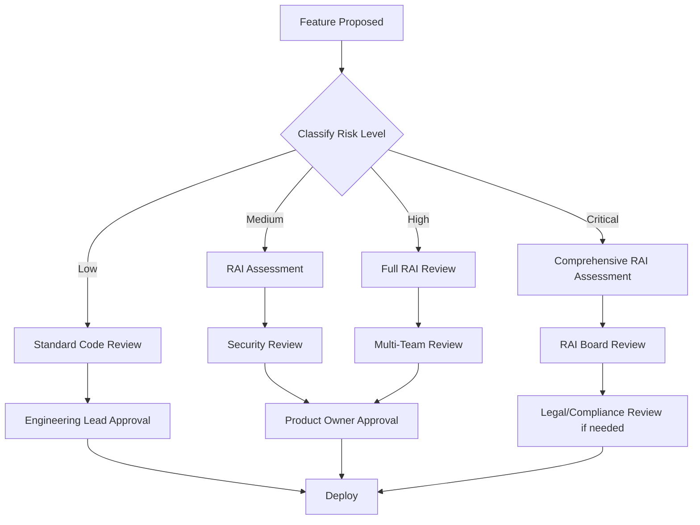

# Responsible AI Principles for AI Discovery Workshop Facilitator

**Document Version:** 1.0  
**Effective Date:** November 19, 2024  
**Applies To:** All AI Discovery Workshop Facilitator (Aida) development and deployment  
**Review Cycle:** Quarterly

---

## Introduction

This document outlines the Responsible AI (RAI) principles that guide the development, deployment, and operation of the AI Discovery Workshop Facilitator system ("Aida"). These principles align with [Microsoft's Responsible AI Standard](https://www.microsoft.com/ai/responsible-ai) and industry best practices.

**Purpose:**  
Ensure that Aida is developed and deployed in a manner that is fair, reliable, safe, private, secure, inclusive, transparent, and accountable.

**Scope:**  
Applies to all team members involved in:
- Feature development and engineering
- Product design and planning
- Data collection and processing
- Model selection and configuration
- Testing and evaluation
- Deployment and operations
- Monitoring and maintenance

---

## Core Principles

### 1. Fairness

**Principle:**  
AI systems should treat all people fairly and avoid affecting similarly situated groups of people in different ways.

**Our Commitment:**

✅ **No Discrimination**  
- Aida does not make decisions about individuals
- Workshop guidance is available equally to all authenticated users
- No user profiling or differential treatment based on protected characteristics

✅ **Inclusive Design**  
- Multiple industry personas to represent diverse sectors
- Guidance adaptable to organizations of all sizes
- Support for users with varying levels of AI expertise

✅ **Regular Evaluation**  
- Quarterly fairness audits across industry slices
- Monitor response quality parity across user types
- Test with diverse user personas and scenarios

**Implementation Requirements:**

```markdown
## Fairness Checklist for New Features

- [ ] Feature tested with diverse user personas (industry, company size, experience level)
- [ ] Response quality measured across key slices
- [ ] No assumptions about user capabilities based on demographics
- [ ] Bias evaluation completed (if applicable)
- [ ] Accessibility requirements met (WCAG 2.1 AA)
- [ ] Localization plan documented (if user-facing)
```

**Accountability:**
- **Engineering Lead:** Ensures fairness testing is completed
- **Product Owner:** Reviews fairness evaluation results
- **RAI Team:** Conducts quarterly fairness audits

---

### 2. Reliability & Safety

**Principle:**  
AI systems should perform reliably and safely, with appropriate safeguards to prevent harmful outputs and behaviors.

**Our Commitment:**

✅ **Reliable Performance**  
- 99%+ system availability target
- Graceful degradation when services unavailable
- Consistent persona adherence and response quality
- Regular testing and quality assurance

✅ **Safety Guardrails**  
- Prompt injection protection in all system prompts
- Input validation to detect malicious patterns
- Content safety filtering (Azure OpenAI capabilities)
- Scope limitation (decline out-of-scope requests)
- Abuse detection and rate limiting

✅ **Error Handling**  
- Informative error messages (no sensitive data exposed)
- Fallback responses when AI fails
- Escalation mechanism to human reviewers
- Logging and monitoring of failures

**Implementation Requirements:**

```markdown
## Safety Checklist for New Features

- [ ] Red team testing completed (prompt injection, jailbreak attempts)
- [ ] Input validation implemented
- [ ] Output filtering applied (if generating dynamic content)
- [ ] Error handling and fallback behaviors defined
- [ ] Safety guardrails documented in system prompts
- [ ] Escalation triggers configured
- [ ] Monitoring alerts set up
```

**Accountability:**
- **Engineering Lead:** Ensures safety testing and guardrails
- **Security Team:** Reviews safety mechanisms and red team results
- **Operations Team:** Monitors safety metrics and alerts

---

### 3. Privacy & Security

**Principle:**  
AI systems should be secure and respect privacy, protecting user data and preventing unauthorized access or misuse.

**Our Commitment:**

✅ **Data Protection**  
- Encryption in transit (TLS 1.2+) and at rest (Azure Storage)
- Per-user conversation isolation (no cross-user access)
- No use of conversation data for model training (Azure OpenAI guarantee)
- 90-day automatic data deletion policy

✅ **Privacy by Design**  
- Minimal data collection (conversation history only)
- PII detection and alerting (planned enhancement)
- No sharing of user data with third parties
- User rights supported (export, deletion)

✅ **Security Controls**  
- Authentication required (password or OAuth)
- Managed identity for Azure service access (no stored credentials)
- Private endpoints for Azure OpenAI and Storage
- Regular security scanning (SAST, dependency checks)
- Vulnerability management (Dependabot)

**Implementation Requirements:**

```markdown
## Privacy & Security Checklist

- [ ] Data flow diagram updated
- [ ] PII handling documented
- [ ] Data retention policy followed
- [ ] Encryption verified (transit and rest)
- [ ] Authentication and authorization tested
- [ ] Secrets management reviewed (no hardcoded credentials)
- [ ] Security scans passing (Bandit, CodeQL, Checkov)
- [ ] Privacy notice updated (if data collection changes)
```

**Accountability:**
- **Engineering Lead:** Ensures security best practices
- **Security Team:** Reviews security controls and scan results
- **Privacy Officer:** Ensures privacy compliance (if required)

---

### 4. Inclusiveness

**Principle:**  
AI systems should empower everyone and engage people in ways that are inclusive and accessible.

**Our Commitment:**

✅ **Accessible Design**  
- Chainlit framework provides baseline web accessibility
- Keyboard navigation support
- Screen reader compatibility (tested quarterly)
- Readable content with appropriate contrast
- Support for assistive technologies

✅ **Broad Accessibility**  
- Web-based interface (no special software required)
- Works across modern browsers
- Responsive design for different screen sizes
- Clear, jargon-free language in user-facing text

✅ **Future Enhancements**  
- Multi-language support (planned)
- Enhanced ARIA labels and semantic HTML
- Comprehensive accessibility testing
- Support for diverse cultural contexts

**Implementation Requirements:**

```markdown
## Inclusiveness Checklist

- [ ] WCAG 2.1 AA compliance verified (for UI changes)
- [ ] Keyboard navigation tested
- [ ] Screen reader tested (if major UI changes)
- [ ] Color contrast meets 4.5:1 ratio
- [ ] Content readable at 200% zoom
- [ ] No reliance on color alone for information
- [ ] Alternative text for images/icons
- [ ] User testing with diverse participants (when feasible)
```

**Accountability:**
- **UX Designer:** Ensures accessible design patterns
- **Engineering Lead:** Implements accessibility features
- **QA Team:** Validates accessibility compliance

---

### 5. Transparency

**Principle:**  
AI systems should be understandable. People should know when they are interacting with AI and understand how AI systems inform decisions that affect them.

**Our Commitment:**

✅ **Clear AI Disclosure**  
- Prominent "AI Assistant" labeling in interface
- Privacy notice on first use explaining AI capabilities
- Help documentation explaining AI limitations
- Links to model card and RAI documentation

✅ **Explainability**  
- Audit logging of agent routing decisions
- Conversation history available to users
- Documentation of how agents are selected
- Confidence indicators (planned enhancement)

✅ **Open Communication**  
- Clear guidance on when to seek human help
- Escalation path for complex issues
- Feedback mechanism (thumbs up/down)
- Documentation of system capabilities and limitations

**Implementation Requirements:**

```markdown
## Transparency Checklist

- [ ] AI disclosure banner visible to users
- [ ] Privacy notice includes AI system description
- [ ] Help documentation updated
- [ ] Model card maintained and linked
- [ ] Limitations clearly documented
- [ ] Escalation process documented
- [ ] User-facing documentation reviewed for clarity
```

**Accountability:**
- **Product Owner:** Ensures clear communication
- **Technical Writer:** Maintains accurate documentation
- **Engineering Lead:** Implements transparency features

---

### 6. Accountability

**Principle:**  
People who design and deploy AI systems must be accountable for how their systems operate, with clear processes for governance and oversight.

**Our Commitment:**

✅ **Governance Process**  
- RAI review required for all AI feature changes
- Change control process with approval gates
- Risk classification for features
- Regular RAI audits (quarterly)

✅ **Human Oversight**  
- Human facilitators required for all workshops
- Admin review capabilities for concerning conversations
- Escalation mechanism to human reviewers
- Override capabilities for AI decisions

✅ **Monitoring & Logging**  
- Comprehensive audit logging
- Safety metrics dashboard
- User feedback tracking
- Incident response playbook

✅ **Continuous Improvement**  
- Regular RAI training for team members
- Post-incident reviews and lessons learned
- Quarterly RAI review meetings
- Annual comprehensive assessment

**Implementation Requirements:**

```markdown
## Accountability Checklist

- [ ] RAI impact assessment completed
- [ ] Risk classification assigned
- [ ] Required approvals obtained (based on risk level)
- [ ] Monitoring and alerting configured
- [ ] Audit logging implemented
- [ ] Incident response plan updated (if needed)
- [ ] Documentation updated
- [ ] Team briefed on changes
```

**Accountability:**
- **Engineering Lead:** Ensures proper review and approvals
- **Product Owner:** Signs off on product changes
- **Security Team:** Reviews security and safety aspects
- **RAI Board:** Approves high-risk changes

---

## Governance Framework

### Roles & Responsibilities

| Role | RAI Responsibilities |
|------|---------------------|
| **Engineering Lead** | Ensure RAI principles applied in development; conduct code reviews; coordinate RAI assessments |
| **Product Owner** | Define ethical product requirements; prioritize RAI improvements; stakeholder communication |
| **Security Team** | Review security controls; conduct red team testing; manage vulnerabilities |
| **RAI Review Board** | Approve high-risk changes; conduct quarterly audits; update RAI policies |
| **QA Team** | Execute RAI test scenarios; validate safety guardrails; accessibility testing |
| **Operations Team** | Monitor RAI metrics; respond to safety alerts; maintain audit logs |
| **All Team Members** | Report RAI concerns; follow RAI guidelines; continuous learning |

### Decision-Making Process

**Feature Risk Classification:**

| Risk Level | Criteria | Review Required | Approvers |
|------------|----------|-----------------|-----------|
| **LOW** | Documentation, UI text changes, minor bug fixes | Standard code review | Engineering Lead |
| **MEDIUM** | New prompts, configuration changes, new agents | RAI assessment | Engineering Lead + Product Owner |
| **HIGH** | Model version changes, safety guardrail changes | Full RAI review | Engineering Lead + Security + Product Owner |
| **CRITICAL** | New data sources, decision-making capabilities | Comprehensive RAI assessment | Full RAI Review Board |

**RAI Review Process:**



### Escalation Process

**When to Escalate:**
- Safety incident detected
- Privacy breach suspected
- Bias or fairness concern identified
- User complaint about AI behavior
- Uncertain about RAI implications

**Escalation Path:**
1. **Immediate Team Lead** (for quick guidance)
2. **Security Team** (for security/safety concerns)
3. **RAI Review Board** (for ethical dilemmas)
4. **Legal/Compliance** (for regulatory concerns)

**Response SLAs:**
- **Critical (P0):** Immediate (24/7 on-call)
- **High (P1):** 4 hours (business hours)
- **Medium (P2):** 24 hours
- **Low (P3):** Next sprint

---

## Training & Awareness

### Required Training

**All Team Members:**
- ✅ Microsoft RAI Principles (annual)
- ✅ Data Privacy & Security Fundamentals (annual)
- ✅ This RAI Principles Document (on-boarding + annual refresh)

**Engineering Team:**
- ✅ Secure Coding Practices (annual)
- ✅ Prompt Injection & LLM Security (annual)
- ✅ Accessibility Development (bi-annual)

**Product & Design:**
- ✅ Inclusive Design Principles (annual)
- ✅ AI Product Ethics (annual)

### Resources

**Internal Resources:**
- [Microsoft Responsible AI Resources](https://www.microsoft.com/ai/responsible-ai)
- [Azure OpenAI Responsible AI](https://learn.microsoft.com/azure/ai-services/openai/concepts/safety)
- [OWASP LLM Top 10](https://owasp.org/www-project-top-10-for-large-language-model-applications/)

**Team Resources:**
- [RAI Review Document](RAI_REVIEW.md)
- [Model Card](MODEL_CARD.md)
- [Security Documentation](security/README.md)
- [STRIDE Threat Model](security/STRIDE_THREAT_MODEL.md)

---

## Incident Response

### RAI Incident Types

**Safety Incidents:**
- AI generates harmful content
- Jailbreak or prompt injection successful
- Abuse of system detected

**Privacy Incidents:**
- Unauthorized data access
- PII leakage in responses
- Cross-user data visibility

**Fairness Incidents:**
- Systematic bias detected
- Discriminatory output reported
- Accessibility barrier identified

**Security Incidents:**
- Vulnerability exploited
- Authentication bypass
- Data breach

### Response Procedure

1. **Detect & Report:**
   - Automated alerts (monitoring)
   - User reports (feedback mechanism)
   - Team member observations

2. **Triage & Classify:**
   - Assess severity (P0-P3)
   - Identify incident type
   - Assign incident commander

3. **Contain & Mitigate:**
   - Immediate actions to prevent further harm
   - Consider system shutdown for P0 incidents
   - Preserve evidence and logs

4. **Investigate:**
   - Root cause analysis
   - Impact assessment
   - Timeline reconstruction

5. **Remediate:**
   - Implement fixes
   - Test thoroughly
   - Deploy to production

6. **Post-Incident:**
   - Post-mortem meeting
   - Update documentation
   - Improve detection/prevention
   - Communicate to stakeholders

### Incident Communication

**Internal:**
- Immediate notification to Engineering Lead and Product Owner
- Security Team for security incidents
- RAI Board for ethical/fairness incidents
- Executive leadership for critical incidents

**External:**
- User communication (if affected)
- Regulatory notification (if legally required)
- Public disclosure (if appropriate)

---

## Metrics & Monitoring

### Key RAI Metrics

**Safety Metrics:**
- Content filter activation rate
- Prompt injection attempt detection
- Abuse pattern detection rate
- Escalation to human reviewers

**Fairness Metrics:**
- Response quality across user slices
- Response length parity
- Sentiment distribution
- User satisfaction by segment

**Privacy Metrics:**
- PII detection rate
- Data access audit logs
- Data deletion requests
- Retention policy compliance

**Transparency Metrics:**
- Disclosure view rate
- Help documentation usage
- Escalation request rate
- User feedback submission rate

**Accountability Metrics:**
- RAI review completion rate
- Security scan pass rate
- Training completion rate
- Incident response time

### Reporting Cadence

**Weekly:**
- Safety metrics dashboard review
- Security alert triage
- User feedback summary

**Monthly:**
- Detailed metrics report
- Trend analysis
- Issue resolution status

**Quarterly:**
- Full RAI audit
- Fairness evaluation
- Comprehensive metrics review
- RAI Board review meeting

**Annually:**
- Comprehensive RAI assessment
- Third-party audit (if applicable)
- Policy and principle review
- Strategy planning

---

## Compliance & Standards

### Regulatory Alignment

**GDPR (if applicable):**
- ✅ Privacy notice provided
- ✅ Data encryption implemented
- ⏳ Right to access (planned)
- ⏳ Right to deletion (planned)
- ✅ Data retention policy

**CCPA (if applicable):**
- ✅ Privacy notice includes AI disclosure
- ✅ Data security measures
- ⏳ Data export capabilities (planned)

**EU AI Act (proposed):**
- Classification: Limited Risk (transparency obligations)
- ✅ AI disclosure to users
- ✅ Documentation (model card, RAI review)
- ✅ Safety guardrails

### Industry Standards

**Microsoft AI Principles:**
- ✅ Fairness
- ✅ Reliability & Safety
- ✅ Privacy & Security
- ⏳ Inclusiveness (accessibility enhancements planned)
- ⏳ Transparency (confidence indicators planned)
- ✅ Accountability

**NIST AI Risk Management Framework:**
- Risk governance and culture
- Risk mapping and measurement
- Risk management and mitigation
- Documentation and transparency

**ISO/IEC Standards:**
- ISO/IEC 23894: AI Risk Management
- ISO/IEC 42001: AI Management System (future consideration)

---

## Continuous Improvement

### Feedback Mechanisms

**User Feedback:**
- In-app thumbs up/down ratings
- User surveys (quarterly)
- Support ticket analysis
- Facilitator feedback sessions

**Internal Feedback:**
- RAI incident reviews
- Team retrospectives
- Security assessment findings
- Code review comments

**External Feedback:**
- Industry best practices
- Regulatory guidance updates
- Academic research
- Peer organization learnings

### Improvement Process

1. **Collect:** Gather feedback from all sources
2. **Analyze:** Identify patterns and priorities
3. **Prioritize:** Risk-based prioritization
4. **Plan:** Include in product roadmap
5. **Implement:** Develop and test improvements
6. **Validate:** Measure effectiveness
7. **Document:** Update RAI documentation

### Policy Review

**Triggers for Policy Update:**
- New regulatory requirements
- Significant incident or near-miss
- Technology changes (new models, capabilities)
- Industry best practice evolution
- Internal audit findings

**Review Process:**
- Draft updates with rationale
- Stakeholder review (Engineering, Product, Legal, Security)
- RAI Board approval
- Team communication and training
- Documentation publication
- Implementation tracking

---

## Attestation

By contributing to the AI Discovery Workshop Facilitator project, all team members attest that they will:

- ✅ Follow these Responsible AI Principles
- ✅ Complete required RAI training
- ✅ Report RAI concerns promptly
- ✅ Participate in RAI reviews and assessments
- ✅ Maintain awareness of RAI best practices
- ✅ Continuously improve RAI practices

---

## Contact & Questions

**RAI Questions:**
- Email: rai-team@your-org.com
- Teams Channel: #rai-discussion (internal)

**Security Concerns:**
- See [SECURITY.md](../SECURITY.md)

**Privacy Questions:**
- Email: privacy@your-org.com

**General Support:**
- Documentation: [docs/](.)
- Email: support@your-org.com

---

## Document Control

| Version | Date | Changes | Approved By |
|---------|------|---------|-------------|
| 1.0 | 2024-11-19 | Initial version | RAI Review Board |

**Next Review:** February 19, 2025 (Quarterly)  
**Owner:** RAI Review Board  
**Distribution:** All team members, stakeholders

---

*These principles are based on [Microsoft's Responsible AI Standard](https://www.microsoft.com/ai/responsible-ai) and align with industry best practices including the [NIST AI Risk Management Framework](https://www.nist.gov/itl/ai-risk-management-framework) and [ISO/IEC 23894](https://www.iso.org/standard/77304.html).*

**Acknowledgments:**  
This document was developed with input from Engineering, Product, Security, and Legal teams, and incorporates guidance from Microsoft's Responsible AI team and industry-leading practices.
