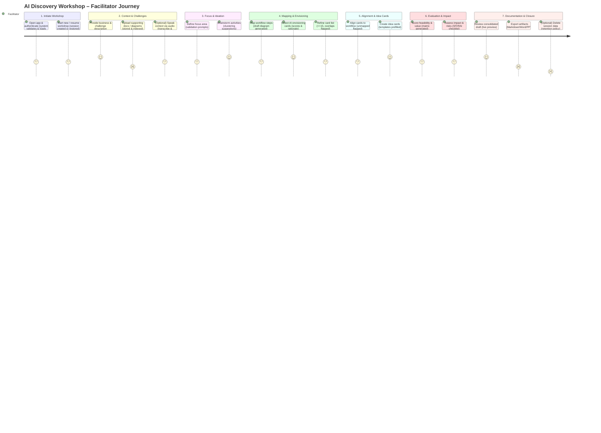
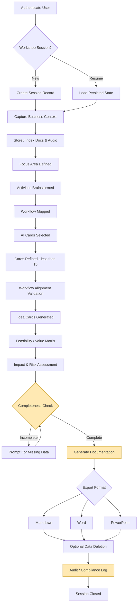

# AIDA Functional Specification: AI Discovery Agent

> Version: 0.1.0 (Draft) - 2025-10-02

## Authors

- Juan Manuel Servera Bondroit (Microsoft)

## 1. Introduction

The AI Discovery Agent is a chat-based, LLM-powered feature for the ai-discovery-agent application. It guides Microsoft facilitators and partners through the structured process of an AI Discovery Workshop, collects all necessary information (including audio and uploaded files), and automatically generates comprehensive documentation using provided templates. The assistant balances structured workflow guidance with facilitator flexibility, ensuring all required data is captured for high-quality workshop outcomes.

---

## 2. Goals

- **Streamline workshop facilitation** by guiding users through all phases of the AI Discovery Workshop.
- **Ensure completeness** of information gathering, prompting for missing data and redirecting as needed.
- **Automate documentation**:
  - Ideally, generation in Word and PowerPoint formats, following official templates.
  - A first version may focus on Markdown output only.
- **Support multilingual workshops** and documentation.
- **Enable session saving and resumption** for interrupted or multi-day workshops.
- **Support audio input** and file uploads (documents, images, hand-drawn diagrams).
- **Single-user facilitation** (no multi-user collaboration in initial release).
- **Comply with SFI and Responsible AI standards.**

---

## 3. Users & Roles

- **Primary Users:**
  - Microsoft facilitators
  - Microsoft partners (trained to run workshops)
- **Role:**
  - “Facilitator” (full access to run, edit, and generate documentation for workshops)

---

## 4. Supported Languages

- Multilanguage support (English, Japanese, German, Spanish, French, etc.)
- Documentation generated in the language used during the workshop session.

---

## 5. Workflow Overview

The assistant guides the facilitator through the following structured phases, with flexibility to revisit or skip steps:

1. **Business and Challenge Description**

   - Collects a detailed overview of the client’s business and specific challenges.

2. **Focus Area Definition**

   - Documents the chosen topic or area for the workshop.

3. **Activity Ideation**

   - Facilitates brainstorming of activities related to the focus area, including “difficult” activities.

4. **Workflow Mapping**

   - Assists in creating a visual map of the activity flow, highlighting critical steps and metrics.

5. **AI Envisioning Cards Selection**

   - Guides discussion and documentation of AI envisioning cards, including scoring.

6. **Refined Card Selection**

   - Supports aggregation and narrowing down to up to 15 cards.

7. **Workflow Alignment**

   - Maps selected AI cards to workflow steps and key metrics.

8. **Idea Cards Creation**

   - Documents each AI-powered idea (title, description, workflow steps, scope).

9. **Feasibility/Value Evaluation**

   - Builds an evaluation matrix for feasibility and value vs. KPIs/metrics.

10. **Impact Assessment**
    - Analyzes data needs, risks, business impact, human value, and metric influence for each idea.

---

## 6. Functional Requirements

### 6.1. Chat-Based Guidance

- The assistant presents each phase as a conversational step.
- Prompts for required information, with context-aware suggestions and examples.
- Reminds facilitator of missing or incomplete sections.
- Allows facilitator to skip, revisit, or reorder steps as needed.
- Supports rich text input (formatted text, lists, tables).
- Presents a draft summary of collected information for review and editing, during the session.

### 6.2. Data Collection & Validation

- Stores all inputs in a structured format, mapped to documentation templates.
- Validates completeness before allowing final documentation generation.
- Supports rich text, tables, and images (e.g., workflow diagrams, photos).

### 6.3. Audio Input

- Facilitators can talk directly to the AI that will automatically transcribe the conversation and integrate it into documentation. Use the microphone button to start/stop sending audio and leverage the chainlit platform capabilities to either send or stream the audio to the backend LLM.
- Users should be able to review and edit transcriptions before finalizing documentation.

### 6.4. Document & Diagram Upload

- Facilitators can upload files (Word, PDF, images, etc.) and hand-drawn diagrams.
- Uploaded content can be referenced, embedded, or appended to the generated documentation.
- Image uploads support common formats (JPG, PNG, PDF, etc.).

### 6.5. Documentation Generation

- Generates output for the documents listed:
  - Word (.docx) using the Report Template
  - PowerPoint (.pptx) using the Workshop Master template
- Populates all required sections:
  - Business and Challenge Description
  - Focus Area Definition
  - Activity Ideation Notes
  - Workflow Map
  - AI Envisioning Cards Selected & Scores
  - Refined Card Selection
  - Workflow Alignment
  - Idea Cards
  - Feasibility/Value Evaluation Matrix
  - Impact Assessment
- Supports export and download of the contents. During the first version, Markdown output may be provided instead of direct Word/PowerPoint generation.

### 6.6. Session Management

- Facilitators can save progress at any time.
- Sessions can be resumed later, restoring all previous inputs.
- Each workshop session is uniquely identified and stored securely.

### 6.7. Multilanguage Support

- Detects and adapts to the facilitator’s language.
- All prompts, guidance, and generated documentation match the session language.

### 6.8. Security & Privacy

- Workshop data is stored securely and only accessible to the facilitator.
- Complies with Microsoft’s privacy and responsible AI guidelines.
- Option to delete workshop data after documentation is generated.
- **Mandatory SFI security review** for every feature before release.
- **Responsible AI review and compliance** for all features and outputs.

---

## 7. Non-Functional Requirements

- **Performance:**

  - Real-time chat response when possible (<2 seconds per prompt), allowing longer times for complex thinking operation, but providing progress indicators and feedback every 5-10 seconds.

- **Reliability:**

  - Session data is auto-saved for every interaction

- **Usability:**

  - Intuitive chat interface, clear prompts, and progress indicators
  - Easy-to-use audio recording and file upload interface
  - Clear instructions and examples for each workshop phase
  - Generate a title for the conversation automatically

- **Accessibility:**
  - WCAG 2.1 AA compliance for all user-facing components

---

## 8. Out-of-Scope (for Initial Release)

- Multi-user collaboration (future enhancement)
- Integration with external systems (e.g., CRM, Teams)
- Advanced analytics or reporting dashboards

---

## 9. Compliance Requirements

- **SFI Security Initiative:**

  - Every feature must undergo a formal security review and approval process.
  - Documentation of security controls and mitigations for each feature.
  - Automated security testing integrated into CI/CD pipelines.
  - Automated infrastructure security checks (e.g., Bicep security scans).

- **Microsoft Responsible AI:**
  - All features and outputs must be reviewed for Responsible AI compliance.
  - Documentation of Responsible AI considerations (fairness, privacy, transparency, accountability, reliability, inclusiveness).

---

## 10. Appendix: Documentation Outputs

At the end of each workshop, the following documents are generated:

- **Business and Challenge Description**
- **Focus Area Definition**
- **Activity Ideation Notes**
- **Workflow Map**
- **AI Envisioning Cards Selected & Scores**
- **Refined Card Selection**
- **Workflow Alignment**
- **Idea Cards**
- **Feasibility/Value Evaluation Matrix**
- **Impact Assessment**
- **Uploaded documents and diagrams** (embedded or appended as appropriate)
- **Audio transcripts** (where applicable)

---

## 11. User Story (for reference)

> As a Microsoft facilitator or partner, I want a chat-based assistant that guides me through the AI Discovery Workshop, collects all required information (including audio and uploaded files), and generates comprehensive documentation in Markdown format that can be easily converted to Word and PowerPoint formats, so that I can efficiently run workshops and deliver high-quality, standardized outputs, while complying with security and Responsible AI standards.

---

## 12. User Journey Map

The following diagrams illustrate the end-to-end facilitator journey, highlighting user actions, system responses, data capture points, and compliance checkpoints (SFI / Responsible AI). The journey diagram focuses on experience flow, while the system interaction flowchart shows underlying state transitions.

### 12.1 Facilitator Experience Journey

Legend (ratings 1–5): number after role indicates relative engagement / effort (1 = minimal, 5 = intensive cognitive input).

### 12.2 System Interaction Flow

Compliance checkpoints (highlighted):

1. Completeness Check – Ensures required structured fields populated.
2. Generate Documentation – Applies SFI / RAI redaction & validation hooks.
3. Audit / Compliance Log – Persists export + deletion actions.

## References

### 1. Microsoft Secure Future Initiative (SFI)

- [Microsoft Secure Future Initiative – Secure by Design](https://www.microsoft.com/en-us/trust-center/security/secure-future-initiative)
  Overview of SFI principles, pillars, and actionable security practices.
- [Microsoft Security Blog: Launching SFI Patterns and Practices](https://www.microsoft.com/en-us/security/blog/2025/08/06/sharing-practical-guidance-launching-microsoft-secure-future-initiative-sfi-patterns-and-practices/)
  Practical guidance and implementation patterns for SFI.
- [SFI Security Academy](https://microsoft.github.io/PartnerResources/skilling/microsoft-security-academy/sfi)
  Training and resources for SFI pillars and security best practices.

---

### 2. Microsoft Responsible AI (RAI)

- [Responsible AI: Ethical Policies and Practices | Microsoft AI](https://www.microsoft.com/en-us/ai/responsible-ai)
  Microsoft’s Responsible AI principles, policies, and transparency reports.
- [Responsible AI Principles and Approach](https://www.microsoft.com/en/ai/principles-and-approach)
  Deep dive into Microsoft’s six Responsible AI principles and their implementation.
- [Responsible AI Transparency Report (2025)](https://www.microsoft.com/en-us/corporate-responsibility/responsible-ai-transparency-report/)
  Annual report on Microsoft’s progress and commitments in Responsible AI.
- [Overview of Responsible AI Practices for Azure OpenAI Models](https://learn.microsoft.com/en-us/azure/ai-foundry/responsible-ai/openai/overview)
  Technical recommendations for responsible use of Azure OpenAI models.

---

### 3. AI Design Guidelines

- [Hands-on tools for building effective human-AI experiences – Microsoft Research](https://www.microsoft.com/en-us/haxtoolkit/)
  Synthesized and validated guidelines for designing effective human-AI interactions.
- [Three foundational principles for copilot UX](https://learn.microsoft.com/en-us/microsoft-cloud/dev/copilot/isv/ux-guidance#three-foundational-principles-for-copilot-ux)
  AI copilots may seem conversational and trustworthy, but they generate responses from training data without true understanding, so it’s crucial to set clear user expectations.
